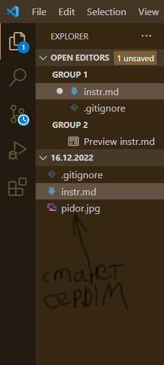

# ИНСТРУКЦИЯ
## Инструкция к git
1. Вначале создаем папку, входим в VS, выбираем File, Open Folder, выбираем папку, которую создали, создаем файл (на данном этапе мы работаем с md), называем файл на английском что бы Git прочел. 
2. Прописываем git init для инициализации репозитория файла.
3. Прописываем git add для добавления файла (всегда вызываем эту команду перед коммитом)
4. Прописываем git status  для того чтобы узнать статус файла
5. Прописываем git commit чтобы указать точку сохранения изменения файла
6. Прописываем git commit -m "сообщение" для того чтобы дать название сохраненному изменению
7. Прописываем git commit -am "сообщение" для того чтобы совместить функцию git add и git commit -m. Если вдруг мы будем почему-то находиться в другом файле и пытаться изменить что-то в этом у нас это не получится так как мы вводим git add и название файла в котором мы находимся. Но если мы в этом файле введем название другого файла мы сможем закоммитить другой файл!
8. Если мы исправили название файла нужно сделать git add.
9. git log используетя для того чтобы просмотреть коммиты. После применения этой функции у нас исчезнет штука в которую вписываются функции. Для появления места нужно тыкнуть Q.
10. ОБЯЗАТЕЛЬНО ПОСЛЕ КАЖДОГО КОММИТА НАЖИМАТЬ CTRL+S дабы сохранить изменение.
11. Функция git branch - для того что бы просмотреть ветки, существующие в нашем репозитории. 
12. НЕСОХРАНЕННЫЙ ФАЙЛ ПОМЕЧЕН БЭЛЫМ КРУЖОЧКОМ! 
13. Мы находимся изначально в ветке master. для того что бы создать ветку необходимо прописать git branch name_branch. 
14. Ветка служит как черновик. мы можем в ней что-либо изменять, не портя при этом ветку master (чистовик)
15. git checkout name_branch - этой командой можно перейти в ветку name_branch
16. git merge name_branch - функция которая соединяет master и name_branch. Очень важно в этот момент находиться в master ветке, а так же что бы ветки не накладывались друг на друга!/
17. git diff - функция для просмотра какие изменения произошли в коммитах.
18. что бы удалить ненужную ветку после слияния необходимо воспользоваться функцией git branch -d name_branch (так же можено использовать D, но лучше использовать d так как git сначала проверит все ли в порядке и если нет то выдаст ошибку)
19. в том случае если ветки накладываются друг на друга необходимо выбрать 3 вариант (оставить оба варианта) а далее уже вручную
20. чтобы добавить изображение в наш файл необходимо прописать:

если прописать Git status гит покажет что у нас в папке есть незакоммиченный файл
если изображение находится в той же папке что и гит мы можем просто указать имя изображения в ().
в [] указывается сообщение, которое высветится если вдруг изображение в preview не отобразится.

мы жмакаем git status и узнаем что у нас теперь есть два файла: instr.md и pidor.jpg 
далее выводим функцию git add instr.md что бы добавить только файл, без изображения. изображение до сих пор не добавлено. 
далее создаем новый файл - .gitignore (название должно быть обязательно такое). этот файл для того что бы вписать туда имя изображения и игнорировать его. 
вписываем git add .gitignore что бы добавить этот файл и коммитим его
git при этом перестеанет спрашивать что делать с изображением, название станет серого цвета

21. git log --graph - функция, похожая на git log, но отображающая ветки 

## Инструкция по семенару
### Действия вне папки
* команда ls -a прописывает все файлы находящиеся в папке
* .gitconfig - глобальный файл гита, в котором хронятся настройки учетной записи
* что бы посмотреть что в .gitconfig необходимо прописать команду cat .gitconfig. Эта команда выдаст нам [core]-обьект гита [user]-пользователь [init]. просматриваем таким образом все глобальные конфиги которые находятся в учетной записи
* git config --list - команда, показывающая все параметры
* дабы отчистить такое количество действий в терменале необходимо ввести clear
* cd ~ - команда что б войти в тильду. тильда - если мы не заходили ни в какой файл, просто пишем что-то в терминале. нам вроде пока такое не надо, если что добалю сюда обьяснения. 
* корзина в терминале = завершить работу терминала
* если мы находимся не в папке и просто что-то пишем в терминале необходимо удалить .git дабы мы не были в ветке master - rm -R .git (master появится если введем команду init в глобальной папке)
### Действия в папке
 + мы хотим указать свое имя и имейл. для этого есть команда git config --local(прописываем имя и имейл, которые распостраняются только на этот файл, так делается в том случае, если мы работаем за компуктером не одни) и git config --global (прописываем свой имейл и имя, которые распостраняются на все файлы)

        * для того что бы прописать имя - git config --global user.name "Имя"
        чтобы проверить - git config user.name (команда выведет имя в терменале)
        * для того что бы прописать имейл - git config --global user.email "Почта"
        чтобы проверить - git config user.email (команда выведет почту в терменале)
 + git config --global core.editor "code --wait" - меняем текущий редактор в конфиге.
 + когда мы создали папку, но в ней еще нет файла для работы, а мы уже в терменале прописали git init, дальнейшие действия начинают происходить в папке в master. но откуда взялся мастер если у нас еще нет файла? Прописываетм команду ls -a, которая выведет что есть у нас в папке. Оказывается когда мы инициализируем папку у нас в ней возникает .git/. Перейдем в папку git: cd .git. Магическим образом у нас (master) меняется на (GIT_DIR!). Смотрим содержимое (GIT_DIR!): ls -a. Высвечиваются непонятные файлы, среди которых есть config. Через команду cat config смотрим что там есть. Ничего интересного мы там конечно же не нашли потому что она пуста, выходим путем ввода команды "__*cd ..*__" (снова окажемся в master)
 + дабы посмотреть все команды гита можно вызвать команду git help
 + дабы посмотреть в интернете все команды гита можно вывести команду git init --help или git commit --help, ... 

### Действия в файле
* когда мы создаем файл в папке в EXPORTER видно что файл лежит в нашей папке и справа от названия файла стоит буква U (untracked - файл, который был создан но еще не записан в ветку). Если мы воспользуемся командой git status мы увидим что наш файл untracked. Для того что бы его записать необходимо воспользоваться командой "git add ." или "git add --all" типа добавляем все. Теперь U сменится на A. После прописываем git commit -m "сообщение" и буква справа пропадает. 
* просматриваем коммиты вводом команды git log (выведет все коммиты в терминал). Для того что бы сократить длину коммитов команду можно прописать как: git log --oneline (иногда в файле бывает много коммитов и что б они занимали меньше пространства придумана эта команда, прописывающая все в сокращенном виде)
* когда мы начинаем действия в файле, в EXPLORER справа от названия файла появляется буква М (modified). Когда файл находится в этом состоянии можно открыть изменения. 

 Про git log:

    + когда мы используем эту команду у нас выплывают все коммиты 
    + перед git log нужно воспользоваться командой git add name.md
    + вместо git log можно пользоваться командой git log --oneline которая выведет коммиды в сокращенном формате. 
    + git log выведет не все коммиты а только последние. Что б ввести все необходимо жмякать ENTER. 
    + после команды пропадает привычная нам строка для записи команд. Чтобы ее вернуть нужно нажать Q. 
    + чтобы вернуться к старой версии (к старому коммиту) прописываем команду git checkout и 4 или более символов желтого цвета, которые являются "названием" коммита.

## Инструкция к Markdown

### Про заголовки и подзаголовки
Для того что бы сделать главный заголовок в тексте необходимо поставить # перед будущим заголовком. Далее по-наростающей - чем подзаголовистее подзаголовок, тем больше # перед текстом заголовка. 
### Про выделение текста курсивом и полужирнымжирным

### Про нумерованный список

### Про маркированный список

### Про зачеркнутый текст

